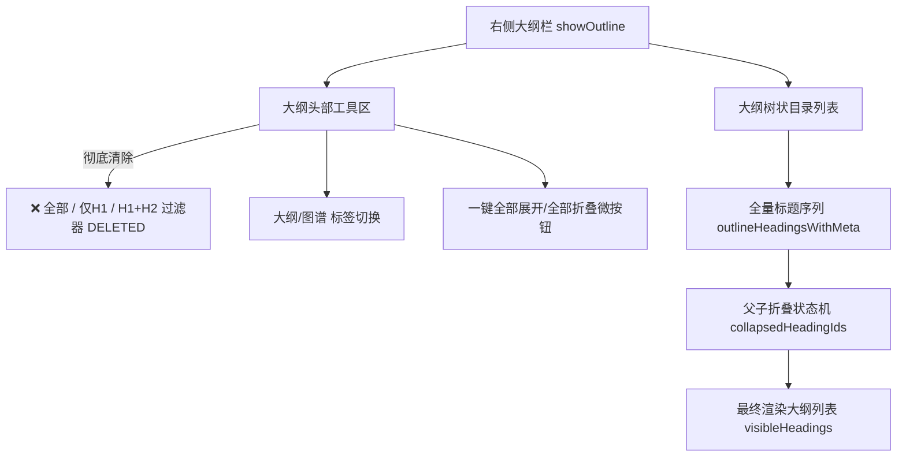

# 技术架构设计与状态机 (Design)

## 1. 架构因果拓扑

```mermaid
flowchart TD
    A[右侧大纲栏 showOutline] --> B[大纲头部工具区]
    A --> C[大纲树状目录列表]
    
    B -->|彻底清除| D[❌ 全部 / 仅H1 / H1+H2 过滤器 DELETED]
    B --> E[大纲/图谱 标签切换]
    B --> F[一键全部展开/全部折叠微按钮]
    
    C --> G[全量标题序列 outlineHeadingsWithMeta]
    G --> H[父子折叠状态机 collapsedHeadingIds]
    H --> I[最终渲染大纲列表 visibleHeadings]
```

## 2. 状态机简化
- 彻底剔除 `outlineFilter` 及其派生状态；
- `filteredHeadings` 简化为纯粹由 `outlineHeadingsWithMeta` 与 `collapsedHeadingIds` 驱动的多层级可见性推导。
